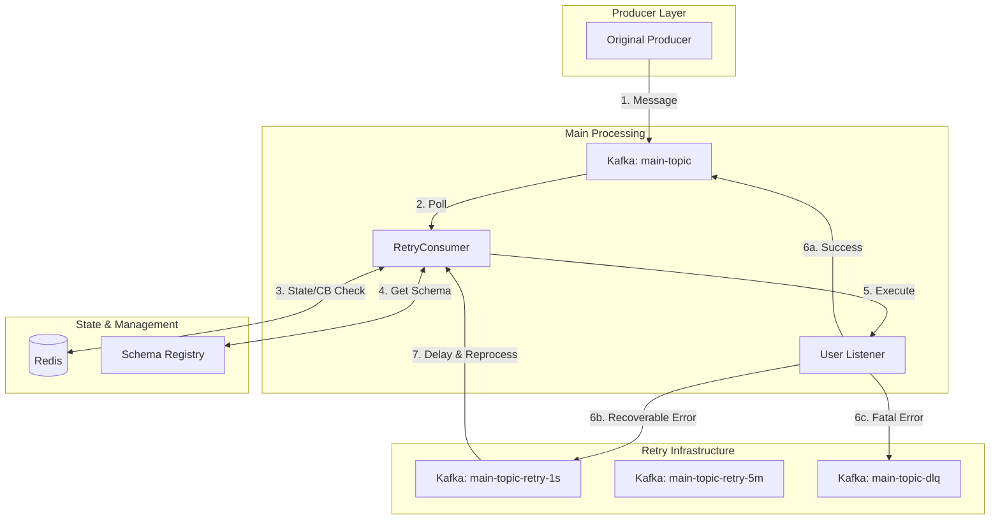
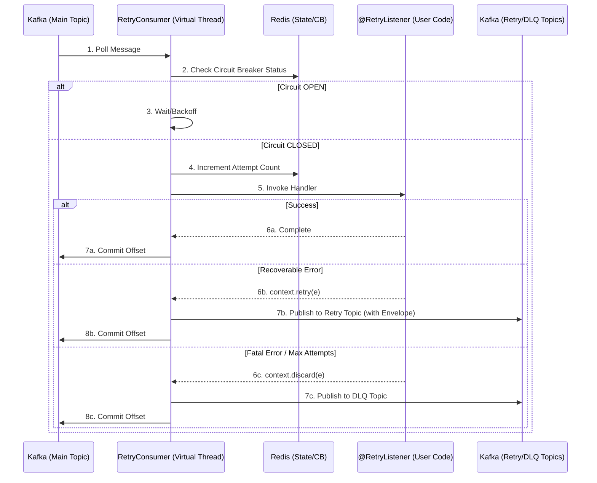

# schema-retry: Kafka Retry Library

High-performance, non-blocking retry library for Java applications using Apache Kafka, Confluent Schema Registry, and Redis.

## 🚀 Overview

`schema-retry` solves the "head-of-line blocking" problem in Kafka consumers while maintaining strict data contracts. It provides a robust, schema-aware retry mechanism that scales with Java 21 Virtual Threads and manages state distributedly via Redis.

## 🏗 Microservices Architecture & Request Flow

The library implements a multi-tier retry strategy where failed messages are routed through a series of time-bucketed retry topics before eventually landing in a Dead Letter Queue (DLQ).

### Architecture Diagram

### Request Flow Sequence

## 🛠 Key Features

- **Non-blocking Retries:** Prevents slow or failing messages from blocking the entire partition.
- **Virtual Thread Support:** Uses Java 21 `Executors.newVirtualThreadPerTaskExecutor()` for high-concurrency processing.
- **Schema Preservation:** Uses `RetryEnvelope` to wrap original payloads while keeping their Schema Registry IDs intact.
- **Distributed State:** Redis tracks retry counts and manages Circuit Breaker states across multiple service instances.
- **Metadata Headers:** Enriches Kafka records with error class, message, and attempt count for better observability.

## 🚦 Tech Stack

- **Language:** Java 21 (Loom/Virtual Threads)
- **Messaging:** Apache Kafka / Confluent Cloud
- **Schema:** Confluent Schema Registry (Avro)
- **State Store:** Redis (Lettuce)
- **Testing:** JUnit 5, Mockito, Testcontainers
